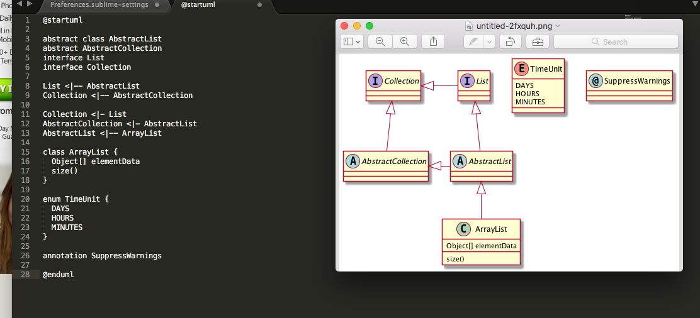
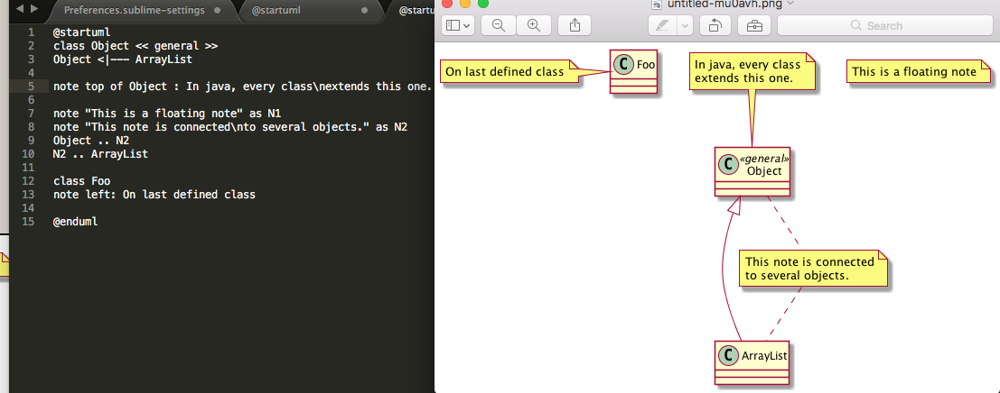

#PlantUML

##What?
**PlantUML 是一个画图脚本语言，用它可以快速地画出：时序图、流程图、用例图、状态图、组件图。** 最大的特点就是可以用脚本语言来生成UML 图，当你熟悉之后，就会发现，一切都那么快！下面介绍一下如何搭建环境。


##How?
基础环境

> *  Java
> *  Graphviz
> *  Sublime Text
> 

1 ）Java 可以通过[点击下载安装包](http://www.oracle.com/technetwork/java/javase/downloads/jdk8-downloads-2133151.html) 方式安装

2 ）Graphviz 通过 brew install graphviz 命令安装。

3 ）Sublime 就不说了。


###Sublime Text 配置

Sublime Text 的集成使用的是 sublime_diagram_plugin 因为默认的包管理中没有，所以需要自己添加源。

> 使用 **Command-Shift-P** 打开 Command Palette
> 
> 输入 add repository 找到 Package Control:Add Repository 
> 
> 在下方出现的输入框中输入 https://github.com/jvantuyl/sublime_diagram_plugin.git 然后回车
> 
> 等待添加完成后再次使用 Command-Shift-P 打开 Command Palette 
> 
> 输入 install package 找到 Package Control:Install Package 
> 
> 等待列表加载完毕，输入 diagram 找到 sublime_diagram_plugin 安装
> 
> 重启 Sublime Text 
>
> 重启后可以在 Preferences -> Packages Setting 看到 Diagram，默认绑定的渲染快捷键是 super + m 也就是 Command + m 如果不冲突直接使用即可。 


###PlantUML 使用手册
[中文版链接](http://translate.plantuml.com/zh)

[英文版链接](http://plantuml.com/)






##Use terminal to open Sublime ?

**用terminal 只需要简单的运行一个脚本：**

####./TerminalCmdForSublime.sh  /Applications/Sublime\ Text.app 

[下载脚本文件](https://github.com/vedon/Develop-skills/blob/master/PlantUML/TerminalCmdForSublime.sh.sh)


```
#保存Sublime 的执行文件位置
sumlineApplicationPath=$1/Contents/SharedSupport/bin/subl

echo subl file path : $sumlineApplicationPath

#在usr/local/bin创建Sublime 符号链接 （/usr/local 是本地系统管理员用来自由添加程序的目录）
ln -s "$sumlineApplicationPath"  /usr/local/bin/sublime

#刷新配置
source ~/.bash_profile

```


然后确定当前环境变量的路径是否有/usr/local/bin 

```
echo $path

输出如下：
/usr/local/bin /usr/bin /bin /usr/sbin /sbin

```

没有的话，可以参照[这里](https://gist.github.com/artero/1236170)的配置。这样就可以在terminal 里面通过sublime 命令来打开sublime 了。同理，其他软件也是可以这样吗？

```
通过以下命令就可以在terminal 打开MacDown了！😄

ln -s /Applications/MacDown.app/Contents/SharedSupport/bin/macdown /usr/local/bin/macdown
```


